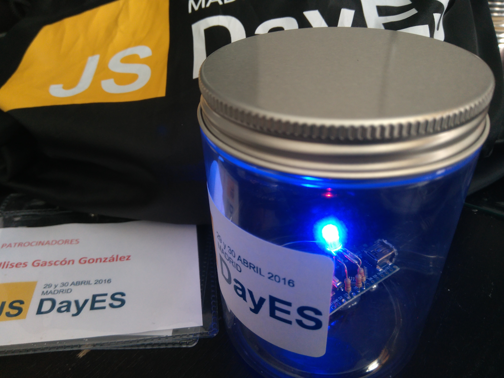

<h2 align="center">:warning: This repository is not longer maintained :warning:</h2>

# JSDayES-golosinas-IOT
Usando un bote de golosinas del #JSDayES, un Arduino nano y un LED RGB... te muestro como hacer un PING lumínico a una URL y que varíe el color según el estatus code de la respuesta.



### Dependencias


- **[J5](http://johnny-five.io/)**
    - [API](http://johnny-five.io/api/)
    - [Ejemplos](http://johnny-five.io/examples/)
    - [Artículos](http://johnny-five.io/articles/)


### Funcionamiento

En el archivo *config.js* definimos la url (sin protocolo) y la frecuencia a la que se realizarán las peticiones.

En *app.js* ocurre toda la magia. Primero se busca el Arduino... se conecta a el y después ejecutamos una tarea repetida que verifica el código de estado en la respuesta HTTP

Por defecto si la respuesta es 200 el Led se vuelve verde, si recibiéramos otra respuesta como redirección (código 301), error (400-500), etc... se tornaría azul.

Y si tuviéramos un error al realizar la petición y no se pudieran retornar las cabeceras con al información esperada... simplemente se torna rojo.

En principio esto se puede ajustar y modificar todo lo que queramos. El led RGB utiliza la misma combinación de colores RGB Hexadecimal como la web, pero no permite usar los colores reservados en palabras clave (aqua, blue, red, etc...) o colores hexadecimales acortados como (#fff, #D2D, etc..)


### Materiales


En este caso:
- 1x Arduino Nano compatible
- 3x Resistencias de 220 ohmios
- 1x Cable USB
- 1x Led RGB

### Conexiones


Simplemente tienes que soldar las patillas del led a los siguientes puntos:
- Patilla Larga -> GND
- Patilla Rojo -> D3
- Patilla Verde -> D5
- Patilla Azul -> D6

Nota: Si lo soldaste en otro orden, no pasa nada siempre que actualices las referencias al *pinout* en *app.js*

Nota: Recuerda que las patillas tienen que conectarse a pins de [tipo PWM](https://www.arduino.cc/en/Tutorial/PWM).

### Fijación


Yo he utilizado pegamento caliente, pero cualquier cosa vale siempre que no sea material conductor :D

### Instalación
Doy por hecho que tienes Node ya instalado en tu sistema.

Instalar las dependencias.
```
npm install
```
Lanzar la aplicación
```
node app
```

### Problemas con Drivers

Si utilizas una placa NANO Compatible puede ser que no te la reconozca el sistema..

Necesitaras instalarte [estos drivers](https://gist.github.com/UlisesGascon/67419ae5c9d995d9ad1e0d47138d7883). Válido para todas las plataformas.


